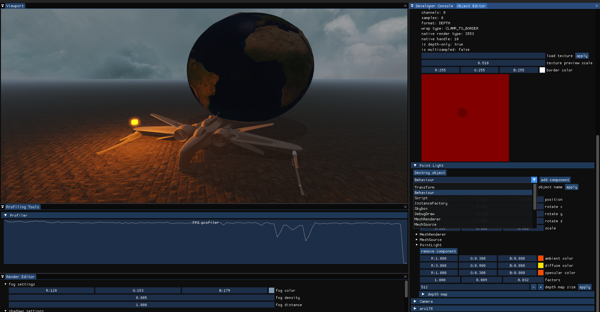

# MxEngine

<!-- soon!  -->

MxEngine is an educational modern-C++ general-purpose 3D game engine. 
Right now MxEngine is developed only by me, #Momo, but any contributions are welcome and will be reviewed.
Fow now MxEngine supports OpenGL as graphic API and targeting x64 only. My plans include other graphic API support, but do not expect it in the near future, as there are still a lot of other stuff to do.

## Additional dependencies
MxEngine is not a huge framework so multiple third-party libraries are used. Here is the full list of dependencies for last MxEngine release version:
- [EASTL](https://github.com/electronicarts/EASTL) - EA standard library which is used in engine core as STL alternative
- [stb](https://github.com/nothings/stb) - header-only one-file library to work with images, audio files and etc.
- [GLEW](http://glew.sourceforge.net/) - OpenGL C/C++ extension loading library
- [GLFW](https://www.glfw.org/) - multi-platform library for OpenGL providing API for creating windows, receiving input and events
- [GLM](https://glm.g-truc.net/0.9.9/index.html) - header only C++ mathematics library for graphics software
- [ImGui](https://github.com/ocornut/imgui) - Bloat-free Immediate Mode Graphical User interface for C++
- [Boost](https://www.boost.org) - large C++ library that you should already know about
- [Assimp](http://www.assimp.org/) - portable Open Source library to import various well-known 3D model formats
- [fmt](https://github.com/fmtlib/fmt) - formatting library for modern C++
- [json](https://github.com/nlohmann/json) - nlohmann's json library for modern C++

All libraries are included in source code (which compiled automatically as part of engine) or compiled as static libraries and stored in zip folders inside engine repository. If you got troubles linking to libs, consider pulling submodule from github and building it yourself.
Note that MxEngine may include more additional libraries in further releases. It also uses [Boost library](https://www.boost.org) in its core, but not exposes it to user-code. Engine requires at least C++17-compatable compiler as it depends on some new STL features. All source files are compiled using MSVC through VS2019, as I mainly use this IDE to develop the engine, but in future other compilers will be supported too.

## Versions & Releases
MxEngine releases comes with version in format X.Y.Z where X stand for major release, Y for minor release and Z for bug fix or non-significant change. 

Major releases are prone to breakage of already existing API and functional but bring a lot new features to the engine. Usually it is possible to rewrite all code using new API and retain former behaviour.

Minor releases may change API or add new features but usually user code can be easily adapted to them. With this releases also come some new MxEngine user libraries (for example new bindings or non-required components)

Bug fixes & improvements are just fixes to already existing code to reestablish initially planned behaviour. This fixes may also be merged into major or minor releases if they come in the same time.

For full version list see versions.md file
## Installing and running MxEngine
Right now MxEngine is distributed in source code as Visual Studio project which can be runned under Windows. Here is the steps you need to do to compile and run test projects:
1. clone this repo to your system using `git clone https://github.com/MomoDeve/MxEngine`
2. run `install.py` file located in the project root directory (you need [python interpreter](https://www.python.org/) to do this)
3. open `MxEngine.sln` located in the project root directory and set startup project to `ProjectTemplate` or `SandboxApplication`
4. click `F5` button and wait until game is loaded (make sure you choose Debug/Release x64 build)

## Answers to some questions:
- Is it possible to build MxEngine under Linux/MacOS/other system?
	> Probably not in the current project state. There are some things which I still need to do before engine can be cross-platform at least on desktops. If you want to help with porting library to other systems, consider reading [PR guideline](https://github.com/MomoDeve/MxEngine/issues/5) .
- Whats the roadmap for the engine? Which features can I expect to see, if I follow this repository?
	> I put all features and not-fixed bugs to the public [trello board](https://trello.com/b/lfPsihUY/mxengine) . If you want to see some specific feature in engine, which is not mentioned already, you can request it in [feature request](https://github.com/MomoDeve/MxEngine/issues/4) issue
- Why do you do this project? How long are you planning to develop the engine? Will it one day be better than UE/Unity/Godot?
	> Initially this was an educational project (actually I still learn a lot of new things when developing it), where I learned about OpenGL, graphics, software engeneering and game development. I loved it and still love to spend my free time fixing some stuff or implementing new features. Thats really a great opportunity to have such cool project, even if it will never be any better than existing game engines like Unity or Unreal Engine
- If I want to help you with development, how can I get into this project? Is there a documentation for it?
	> Sadly there are too much things that I need to document and so much features which I need to implement, that I have almost no time for proper documentation. You can start with `ProjectTemplate` VS project, and try some things for yourself. I promise I will add more samples with each release to make usage of the engine easier. If you want to help me with developing, building on other systems or fixing bugs, first contact me personally (links to my social media can be found in [my profile](https://github.com/MomoDeve/) ). We can discuss what you may do and how can you help the engine to progress